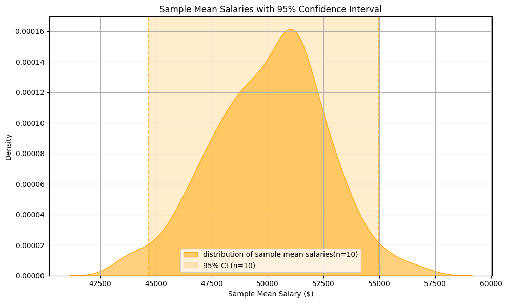
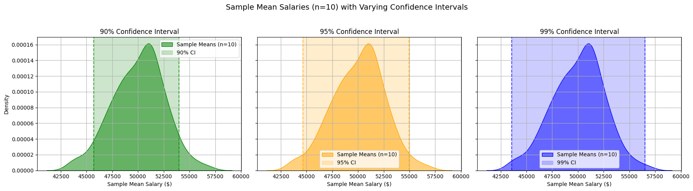
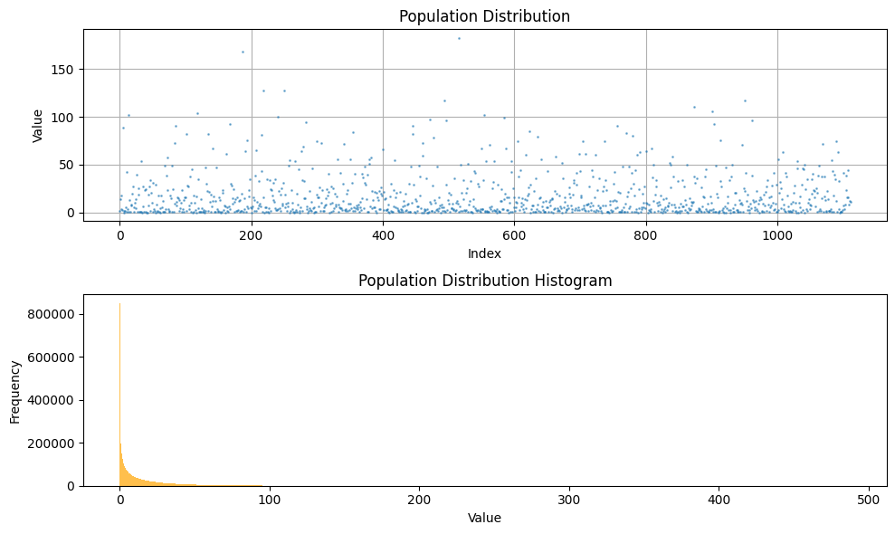
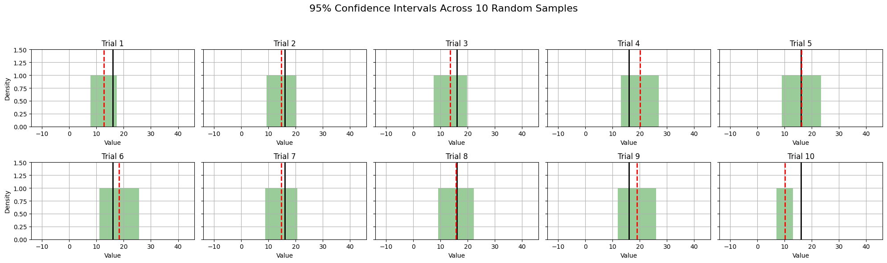
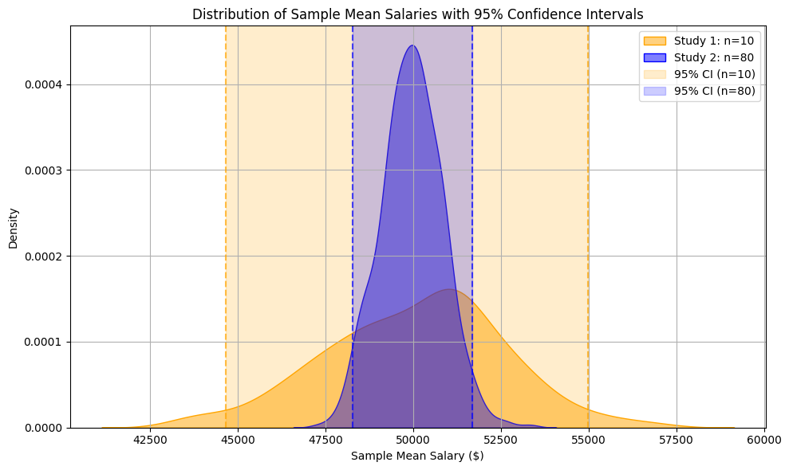
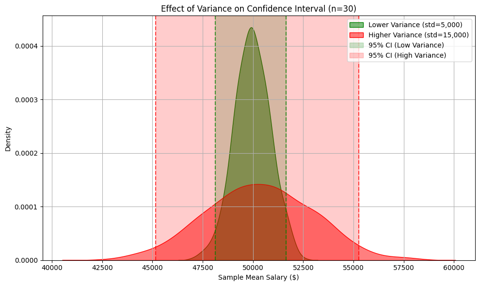

# Confidence Intervals

- [Confidence Intervals](#confidence-intervals)
  - [Common confidence levels](#common-confidence-levels)
  - [Why Do We Need Confidence Intervals?](#why-do-we-need-confidence-intervals)
  - [Confidence Interval Formula and Example Illustration](#confidence-interval-formula-and-example-illustration)
  - [How to Influence the Size of a Confidence Interval](#how-to-influence-the-size-of-a-confidence-interval)
    - [Situation 1: Effect of Increasing Sample Size](#situation-1-effect-of-increasing-sample-size)
    - [Situation 2:  Effect of Variance (Standard Deviation)](#situation-2--effect-of-variance-standard-deviation)

A **confidence interval (CI)** is a range of values, derived from sample data, that is likely to contain the true population parameter (like a mean or proportion) with a certain level of confidence.

> For example, to estimate the population’s average salary, we randomly selected 10 people and calculated the sample mean salary. We repeated this process 500 times. The graph below shows the distribution of these sample means. The shaded region represents the 95% confidence interval, meaning we are 95% confident that the true population mean (which is $50,000) lies within this range.

    

---

## Common confidence levels

Common confidence levels include **90%**, **95%**, and **99%**, but these values are ultimately **arbitrary conventions**. They reflect how confident we want to be that our interval contains the true population parameter. A higher confidence level means a wider interval, offering more certainty but less precision.

    

---

## Why Do We Need Confidence Intervals?

Confidence intervals are important because:

- **They reflect uncertainty**. Instead of giving just a single estimate (like a sample mean), they provide a range, acknowledging sample variability.

- **They support statistical reasoning**. CIs help us understand how precise our estimates are.

- **They enable comparison**. If two confidence intervals do not overlap, this often (but not always) suggests a statistically significant difference.

- **They are more informative than p-values**. A CI tells you the magnitude and direction of an effect, not just whether it’s “significant”.

---

## Confidence Interval Formula and Example Illustration

When estimating the **population mean** from a sample, the formula for a confidence interval is:

$$
\text{CI} = \bar{x} \pm z^* \cdot \frac{s}{\sqrt{n}}
$$

Where:

- $\bar{x}$ is the sample mean

- $s$ is the sample standard deviation

- $n$ is the sample size

- $\frac{s}{\sqrt{n}}$ is the **standard error** of the mean

- $z^*$ is the **critical value** from the standard normal distribution (depends on confidence level)

When the **population standard deviation (σ)** is unknown — which is almost always the case in real-world studies — the correct formula uses the **t-distribution** instead of the z-distribution.

$$
\text{CI} = \bar{x} \pm t^* \cdot \frac{s}{\sqrt{n}}
$$

Where:

- $\bar{x}$ = sample mean

- $s$ = sample standard deviation

- $n$ = sample size

- $\frac{s}{\sqrt{n}}$ = standard error

- $t^*$ = critical value from the t-distribution with df = n - 1

---

> We designed an experiment to illustrate how **confidence intervals** (using the t-distribution) behave when sampling from a **non-normal population**.

A right-skewed population was generated, and its **distribution** and **histogram** are shown below to demonstrate that the population is not normally distributed.

    

We then ran 10 independent sampling experiments:

- In each experiment, we randomly selected **40 data points** from the population.

- We calculated the **sample mean** and the corresponding **95% confidence interval** using the **t-distribution**.

- Each confidence interval was visualized alongside the true population mean.

    

We have the following observation:

- The green shaded region shows the 95% confidence interval for each sample.

- The black vertical line marks the true population mean.

- The red dashed line marks the sample mean.

- Even though the population is not normal, the Central Limit Theorem ensures that the sampling distribution of the mean is approximately normal (since n = 40), allowing t-based confidence intervals to remain valid.

As expected with a 95% confidence level, the true mean falls within the interval in most of the trials.

---

## How to Influence the Size of a Confidence Interval

From the confidence interval formula:

$$
\text{CI} = \bar{x} \pm t^* \cdot \frac{s}{\sqrt{n}}
$$

We can tell that the **width of the confidence interval** is influenced by two key factors:

- **Sample size**, $n$: As $n$ increases, the standard error $\frac{s}{\sqrt{n}}$ decreases, so the CI becomes **narrower**(smaller).

- **Sample standard deviation**, $s$: As the variance (or standard deviation) decreases, the CI also becomes **narrower**(smaller).

---

### Situation 1: Effect of Increasing Sample Size

Let’s demonstrate how a larger sample size makes the confidence interval narrower.

- Study 1: Sample 10 people, calculate average salary, repeat 500 times.

- Study 2: Sample 80 people, calculate average salary, repeat 500 times.

    

---

### Situation 2:  Effect of Variance (Standard Deviation)

- Study 1: Sample 30 people from a population with standard deviation = $5,000, repeat 500 times.

- Study 2: Sample 30 people from a population with standard deviation = $15,000, repeat 500 times.

> We manually controlled the sample standard deviation

    

---